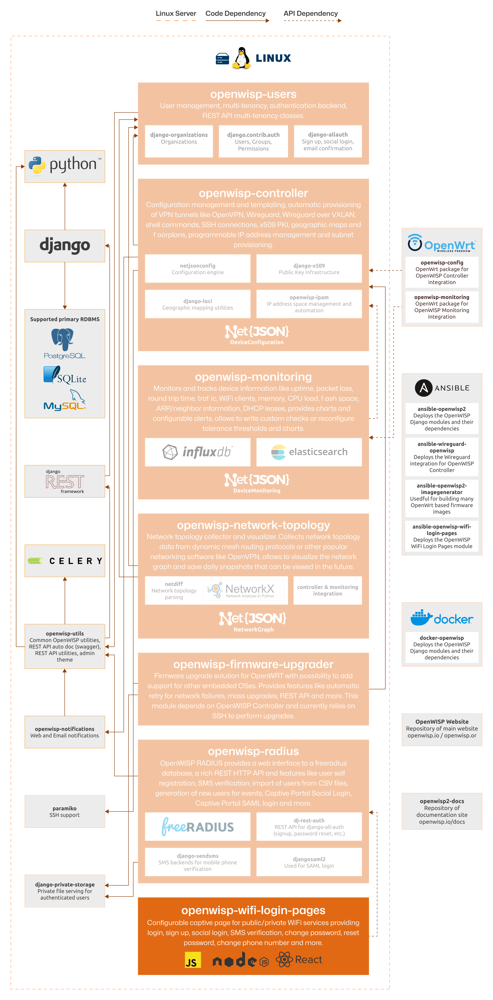

WiFi Login Pages
================

.. seealso::

    **Source code**: `github.com/openwisp/openwisp-wifi-login-pages
    <https://github.com/openwisp/openwisp-wifi-login-pages>`_.

.. figure:: https://raw.githubusercontent.com/openwisp/openwisp-wifi-login-pages/media/docs/login-desktop.png
    :target: https://raw.githubusercontent.com/openwisp/openwisp-wifi-login-pages/media/docs/login-desktop.png
    :align: center

OpenWISP WiFi login pages provides unified and consistent user experience
for public/private WiFi services. This app replaces the classic
captive/login page of a WiFi service by integrating the :doc:`OpenWISP
Radius API </radius/user/rest-api>`.

Refer to :doc:`user/intro` for a complete overview of features.

The following diagram illustrates the role of the WiFi Login Pages module
within the OpenWISP architecture.

    **OpenWISP Architecture: highlighted wifi login pages module**

.. important::

    For an enhanced viewing experience, open the image above in a new
    browser tab.

    Refer to :doc:`/general/architecture` for more information.

.. toctree::
    :caption: WiFi Login Pages Usage Docs
    :maxdepth: 1

    ./user/intro.rst
    ./user/setup.rst
    ./user/internet-mode.rst
    ./user/translations.rst
    ./user/handling-radius-errors.rst
    ./user/extra-js.rst
    ./user/settings.rst

.. toctree::
    :caption: WiFi Login Pages Developer Docs
    :maxdepth: 2

    Developer Docs Index <developer/index.rst>

.. note::

    For a demonstration of how this module is used, please refer to the
    following demo tutorial: :doc:`WiFi Hotspot, Captive Portal (Public
    WiFi), Social Login <../tutorials/hotspot>`.
